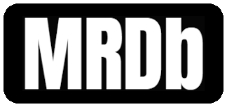

<div id="top"></div>

<!-- PROJECT LOGO -->
<br />
<div align="center">
  <a href="https://mrdb.mieze.dev">
    
  </a>

<h3 align="center">MRDb</h3>

  <p align="center">
    Movie Rating Database
    <br />
    <a href="https://mrdb.mieze.dev">View Demo</a>
  </p>
</div>

<!-- TABLE OF CONTENTS -->
<details>
  <summary>Table of Contents</summary>
  <ol>
    <li>
      <a href="#about-the-project">About The Project</a>
      <ul>
        <li><a href="#built-with">Built With</a></li>
      </ul>
    </li>
    <li>
      <a href="#getting-started">Getting started</a>
      <ul>
        <li><a href="#prerequisites">Prerequisites</a></li>
        <li><a href="#installation">Installation</a></li>
        <li><a href="#deployment">Deployement</a></li>
      </ul>
    </li>
    <li><a href="#usage">Usage</a></li>
    <li><a href="#roadmap">Contributing</a></li>
    <li><a href="#license">License</a></li>
    <li><a href="#contact">Contact</a></li>
  </ol>
</details>

<!-- ABOUT THE PROJECT -->
## About The Project


MRDB is a simple aggregator which aims to gather the rating of movies and tv shows from major platforms, such as IMDb, Rotten Tomatoes or Metacritic.

<p align="right">(<a href="#top">back to top</a>)</p>

### Built With

* [Angular](https://angular.io/)
* [Bulma](https://bulma.io/)
* [Gulp.js](https://gulpjs.com/)
* [Spring Boot](https://start.spring.io/)

<p align="right">(<a href="#top">back to top</a>)</p>

<!-- GETTING STARTED -->
## How it works

Bulma for the design and Angular for the frontend process.
Springboot for the backend process as a REST API which take movies data from an external API with the DAO pattern.

### Prerequisites

* [Node.js & npm](https://nodejs.org/en/)
* [Angular CLI](https://angular.io/cli)
* [Java](https://www.oracle.com/java/technologies/downloads/)

### Installation

1. Get a free API Key at [RapidAPI](https://rapidapi.com/rapidapi/api/movie-database-imdb-alternative/)
2. Clone the repo
   ```sh
   git clone https://github.com/joelmieze/MRDb.git
   ```
3. Install NPM packages in frontend folder
   ```sh
   npm install
   ```
4. Create your [Maven Project](https://start.spring.io/) with Spring Boot dependencies (refer to pom.xml)
5. Move backend folder content to your Java project sources
5. Enter your API credentials in `/dao/impl/RapidAPIDAOImpl.java`
   ```java
   private static final String URL_API_MOVIE_DATABASE = 'ENTER YOUR API ENDPOINT';
   private static final String RAPIDAPI_KEY = 'ENTER YOUR CREDENTIALS';
   ```

### Deployment

You can deploy your app on [AWS](https://aws.amazon.com/fr/elasticbeanstalk/) like this demo or use any other type PaaS solutions like Microsoft Azure, Heroku or Google App Engine. In this case, you have to [create an executable JAR with your Maven project](https://www.baeldung.com/executable-jar-with-maven).

<p align="right">(<a href="#top">back to top</a>)</p>

<!-- CONTRIBUTING -->
## Contributing

Contributions are what make the open source community such an amazing place to learn, inspire, and create. Any contributions you make are **greatly appreciated**.

If you have a suggestion that would make this better, please fork the repo and create a pull request. You can also simply open an issue with the tag "enhancement".
Don't forget to give the project a star! Thanks again!

1. Fork the Project
2. Create your Feature Branch (`git checkout -b feature/NewFeature`)
3. Commit your Changes (`git commit -m 'Add some NewFeature'`)
4. Push to the Branch (`git push origin feature/NewFeature`)
5. Open a Pull Request

<p align="right">(<a href="#top">back to top</a>)</p>

<!-- LICENSE -->
## License

Distributed under the MIT License. See `LICENSE.txt` for more information.

<p align="right">(<a href="#top">back to top</a>)</p>

<!-- CONTACT -->
## Contact

Joël Mieze - joel@mieze.dev

Project Link: [https://github.com/joelmieze/MRDb](https://github.com/joelmieze/MRDb)

<p align="right">(<a href="#top">back to top</a>)</p>